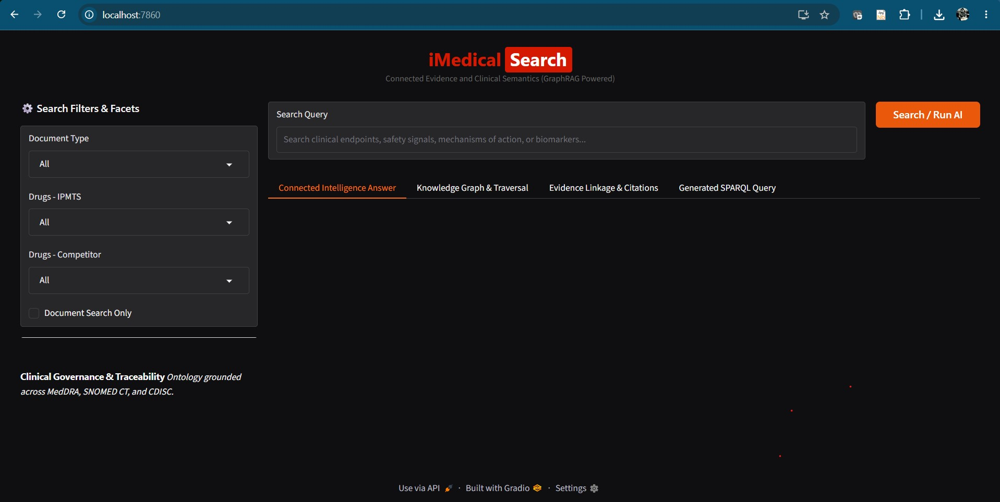
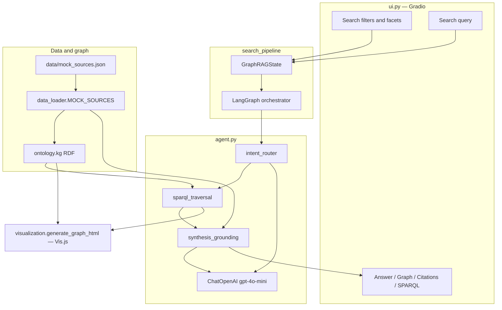

# iMedical Search (GraphRAG)

Application that answers clinical-trial questions by traversing an RDF knowledge graph, then synthesizing a grounded response with citations and a live graph visualization.

Entry point: [`ui.py`](ui.py).

## Application preview

The portal **iMedical Search** (dark theme) is a two-column layout: filters on the left, query and result tabs on the right.

<p align="center">
  
</p>

- **Header** — *iMedical Search* with subtitle *Connected Evidence and Clinical Semantics (GraphRAG Powered)*.
- **Search filters & facets** — Document Type, Drugs – IPMTS, Drugs – Competitor, and Document Search Only.
- **Search bar** — Natural-language query plus **Search / Run AI**.
- **Result tabs** — Connected Intelligence Answer, Knowledge Graph & Traversal, Evidence Linkage & Citations, Generated SPARQL Query.
- **Governance note** — Ontology grounded across MedDRA, SNOMED CT, and CDISC.
- **Footer** — Gradio *Use via API*, *Built with Gradio*, and Settings.

---

## Overview

**iMedical Search** is a GraphRAG (graph-augmented retrieval) prototype for clinical trial intelligence. A user submits a natural-language query plus optional facets (document type, IMPTS drug, competitor drug, document-search-only). The app:

1. Classifies clinical **intent** (protocol feasibility, trial comparison, safety surveillance, endpoint evidence, or scientific response).
2. **Traverses** the RDF graph from matching study nodes (up to three hops) and materializes a SPARQL-style query for audit.
3. **Synthesizes** an answer with the LLM using graph triples plus the structured source payload.
4. Renders **intent, grounding score, citations, SPARQL, and a highlighted Vis.js graph** of the traversal path.

The UI is branded as *Connected Evidence and Clinical Semantics*. Ontology alignment is described in the portal as MedDRA, SNOMED CT, and CDISC; the in-repo graph uses a custom `cti:` namespace populated from mock clinical records.

---

## Data sources

Runtime knowledge comes from [`data/mock_sources.json`](data/mock_sources.json), loaded by [`data_loader.py`](data_loader.py) as `MOCK_SOURCES`.

| Source type | Role in the graph | Example studies |
| --- | --- | --- |
| **Clinical Study Reports** | Study, disease (SNOMED), therapeutic area, IMPTS treatment, competitor/comparator, active ingredient, mechanism of action | NCT04561234 (Daratumumab / MM), NCT02665364 (Amivantamab / NSCLC), NCT03145181 (Teclistamab / RRMM) |
| **Protocols & Amendments** | Population and required biomarker | CD38+ plasma cells, EGFR Exon 20 insertion, BCMA expression |
| **Safety / RIM Content** | Safety report, adverse event, MedDRA PT and SOC | Neutropenia, infusion-related reaction, CRS |
| **Scientific Responses** | Response document, inquiry topic, medical concept | SubQ PK in renal impairment, hepatic dosing, ICANS |

[`data/generate_mock_raw_files.py`](data/generate_mock_raw_files.py) can emit a separate “raw data lake” layout (`clinical_raw_data/`) as JSON/TXT files. That generator is **not** on the `ui.py` path; the live app reads the consolidated JSON above.

[`ontology.py`](ontology.py) maps those records into RDF (`rdflib`) under `https://w3id.org/cti/ontology#`, exposing a module-level graph `kg`.

---

## Architecture



| Layer | Module | Responsibility |
| --- | --- | --- |
| Presentation | `ui.py` | Gradio Blocks: filters, search, four result tabs, CSS theme |
| Orchestration | `agent.py` | `GraphRAGState`, three-node LangGraph workflow, OpenAI LLM |
| Semantics | `ontology.py` | Build and export RDF `kg` from mock sources |
| Sources | `data_loader.py` | Load `data/mock_sources.json` |
| Visualization | `visualization.py` | Hierarchical Vis.js iframe; gold nodes / crimson edges for active traversal |

**UI layout**

- Left column: Document Type, Drugs – IPMTS, Drugs – Competitor, Document Search Only.
- Right column: query box, grounding badge (intent, grounding score, node count).
- Tabs: Connected Intelligence Answer, Knowledge Graph & Traversal, Evidence Linkage & Citations, Generated SPARQL Query.

---

## Execution flow

1. **Startup**  
   Importing `ui.py` loads `MOCK_SOURCES`, builds `kg`, compiles `orchestrator`, and seeds the graph tab with the full ontology (no highlights).

2. **User action**  
   Click **Search / Run AI** or submit the search box. `search_pipeline` runs.

3. **Validation**  
   Empty query returns a prompt and the unhighlighted graph. Otherwise filters are packed into `selected_filters`.

4. **LangGraph (`orchestrator.invoke`)**  
   - **intent_router** — LLM classifies the query into one of five clinical intents.  
   - **sparql_traversal** — Keyword/heuristic mapping to study IDs (e.g. daratumumab / myeloma → NCT04561234; amivantamab / NSCLC → NCT02665364; teclistamab / BCMA / ICANS → NCT03145181; otherwise all three). From each `ClinicalStudy` URI, walk outgoing RDF links for three hops, collecting `traversed_nodes`, `traversed_edges`, and `graph_evidence`. Emit a SPARQL `SELECT` that reflects those studies, treatments, MoA, and MedDRA SOC.  
   - **synthesis_grounding** — LLM writes the clinical answer from intent, filters, graph triples (first 25), and full `MOCK_SOURCES`. Returns a fixed high grounding score and citation labels.

5. **UI update**  
   Grounding markdown, answer, bullet citations, SPARQL code, and `generate_graph_html(kg, active_nodes, active_edges)` so the traversed path is highlighted and the rest of the graph is dimmed.

```text
Query + filters
    → GraphRAGState
        → intent_router
        → SPARQL / 3-hop RDF traversal
        → LLM synthesis + citations
    → Gradio outputs + highlighted Vis.js graph
```

---

## How to use

### Prerequisites

- Python 3.10+ recommended  
- OpenAI API key (`ChatOpenAI` / `gpt-4o-mini` in [`agent.py`](agent.py))  
- Packages used by this app: `gradio`, `rdflib`, `langgraph`, `langchain-core`, `langchain-openai` (see [`requirements.txt`](requirements.txt); add `langgraph` if it is not already installed)

### Setup

```bash
cd KnowledgeGraph
python -m venv .venv
# Windows
.venv\Scripts\activate
pip install -r requirements.txt
pip install langgraph
```

Set the API key in the environment (do not commit secrets):

```bash
# Windows PowerShell
$env:OPENAI_API_KEY = "sk-..."
```

### Run the portal

```bash
python ui.py
```

The Gradio server binds to `0.0.0.0:7860`. Open `http://localhost:7860` in a browser.

### Search

1. Optionally set **Document Type**, **Drugs – IPMTS**, **Drugs – Competitor**, and **Document Search Only**.  
2. Enter a query (endpoints, safety signals, mechanism of action, biomarkers, etc.).  
3. Run search. Review:
   - **Connected Intelligence Answer** — synthesized clinical response  
   - **Knowledge Graph & Traversal** — gold nodes and crimson edges on the active path; Reset View / Toggle Physics in the canvas  
   - **Evidence Linkage & Citations** — document-level citations  
   - **Generated SPARQL Query** — SPARQL corresponding to the retrieved studies  

Example queries: subcutaneous daratumumab and neutropenia; amivantamab in EGFR Exon 20 NSCLC; teclistamab and ICANS.

### Notes

- `util/app.py` and related files are earlier monoliths; **`ui.py` is the modular application**.  
- `main.py` is a placeholder and does not launch the UI.  
- Graph traversal is heuristic (keywords + RDF walks), not a live SPARQL engine against an external triple store. The SPARQL tab is an auditable representation of what was retrieved.
